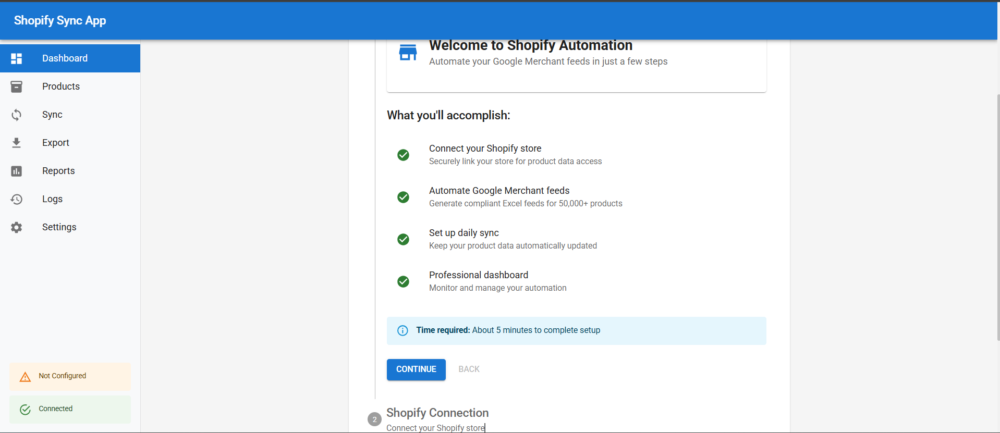
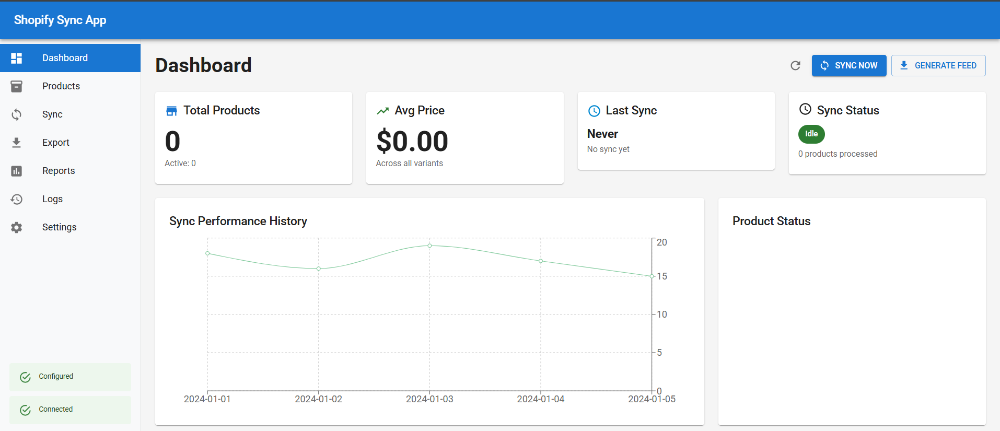
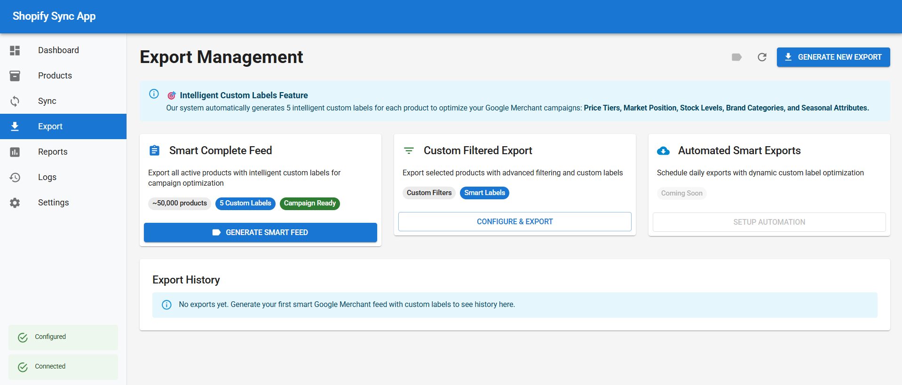
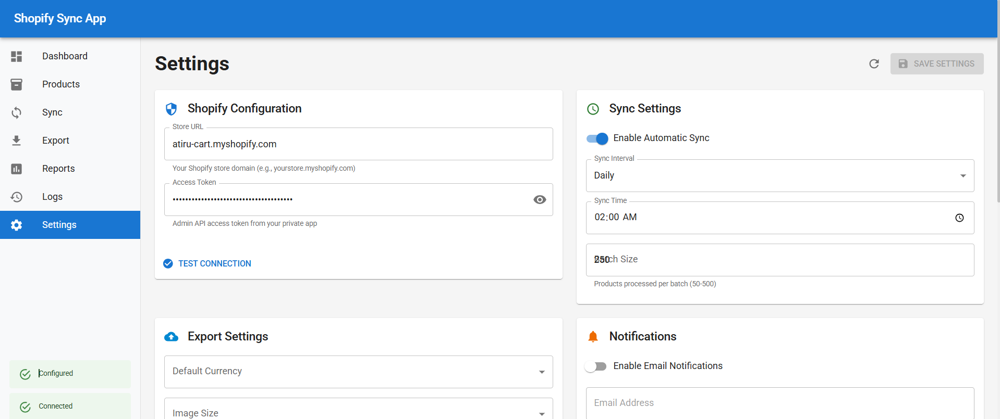

# Shopify Google Merchant Automation

A comprehensive Node.js application that automates Google Merchant Center feed generation from Shopify stores. Built with React frontend and Express backend.

## 🚀 Features

- **Automated Product Sync**: Full and incremental sync of 50,000+ products
- **Google Merchant Feeds**: Generate compliant Excel exports
- **Professional Dashboard**: Real-time monitoring and analytics
- **Smart Rate Limiting**: Respects Shopify API limits
- **Variant Selection**: Automatically selects lowest-priced variants
- **Scheduled Operations**: Daily automated syncs
- **Error Recovery**: Comprehensive error handling and retry logic
- **Azure Ready**: Prepared for cloud deployment

## Screenshots






## 📋 Prerequisites

- Node.js 18+ and npm
- Shopify admin access with API permissions
- 2GB free disk space
- Git (optional, for version control)

## 🛠️ Installation

### 1. Clone or Download Project
```bash
# If using Git
git clone <repository-url>
cd shopify-google-merchant-sync

# Or download and extract the ZIP file
```

### 2. Install Dependencies
```bash
# Install backend dependencies
npm install

# Install frontend dependencies
npm run install-client
```

### 3. Environment Setup
```bash
# Copy environment template
cp .env.example .env

# Edit .env file with your settings
NODE_ENV=development
PORT=3001
ENCRYPTION_KEY=your-32-character-secret-key-here
```

### 4. Initialize Database
```bash
# The database will be automatically created on first run
npm run setup
```

## 🚀 Quick Start

### Start the Application
```bash
# Development mode (both backend and frontend)
npm run dev

# Production mode
npm run build
npm start
```

### Access the Application
- Open your browser to `http://localhost:3001`
- Follow the setup wizard to configure your Shopify connection

## ⚙️ Shopify Configuration

### 1. Create Private App
1. Go to your Shopify Admin → Settings → Apps and sales channels
2. Click "Develop apps" → "Create an app"
3. Give your app a name (e.g., "Product Feed Automation")

### 2. Configure Permissions
Request these Admin API scopes:
- **Products**: `read_products` (Required)
- **Inventory**: `read_inventory` (Required)
- **Orders**: `read_orders` (Optional)

### 3. Get Access Token
1. Click "Install app"
2. Reveal and copy the "Admin API access token"
3. Use this token in the application setup

## 📁 Project Structure

```
shopify-google-merchant-sync/
├── server.js                 # Main server file
├── package.json             # Backend dependencies
├── .env.example            # Environment template
├── src/                    # Backend source
│   ├── database.js         # SQLite operations
│   ├── shopifyAPI.js       # Shopify integration
│   ├── excelGenerator.js   # Feed generation
│   ├── syncManager.js      # Sync orchestration
│   └── configManager.js    # Configuration management
├── client/                 # React frontend
│   ├── src/
│   │   ├── components/     # React components
│   │   ├── services/       # API services
│   │   └── App.js         # Main React app
│   ├── package.json       # Frontend dependencies
│   └── public/
├── data/                  # Database and config files
├── exports/              # Generated Excel files
└── docs/                # Documentation
```

## 🔄 Usage Guide

### Initial Setup
1. **Start Application**: `npm run dev`
2. **Setup Wizard**: Follow the configuration wizard
3. **Test Connection**: Verify Shopify connectivity
4. **First Sync**: Run initial product import (15-20 minutes)

### Daily Operations
1. **Monitor Dashboard**: Check sync status and statistics
2. **Generate Feeds**: Create Google Merchant Excel exports
3. **Review Logs**: Monitor for any errors or issues
4. **Manage Products**: Browse and filter product catalog

### Sync Operations
- **Full Sync**: Downloads all products (use for initial setup)
- **Incremental Sync**: Updates only changed products (daily use)
- **Scheduled Sync**: Automatic daily updates at 2 AM

## 📊 Dashboard Features

### Overview Cards
- Total products count
- Average price across catalog
- Last sync timestamp
- Current sync status

### Real-time Monitoring
- Live sync progress tracking
- Error alerts and notifications
- Performance metrics
- System health indicators

### Product Management
- Searchable product catalog
- Filter by vendor, type, price
- Bulk export operations
- Product status tracking

## 📤 Export Features

### Google Merchant Format
- Complete field mapping compliance
- Automatic data validation
- Lowest price variant selection
- Image optimization

### Export Options
- **Complete Feed**: All active products
- **Filtered Export**: Custom product selection
- **Scheduled Export**: Automated daily exports (coming soon)

### File Management
- Download generated Excel files
- Export history tracking
- Automatic file cleanup
- Performance metrics

## 🔧 Configuration Options

### Sync Settings
- **Auto Sync**: Enable/disable automatic daily sync
- **Sync Time**: Preferred time for daily operations
- **Batch Size**: Products processed per batch (50-500)
- **Webhooks**: Real-time product updates (optional)

### Export Settings
- **Currency**: Default currency for prices (USD, EUR, GBP, CAD)
- **Image Size**: Product image resolution
- **Include Options**: Out of stock, unpublished products
- **File Format**: Excel or CSV output

### Advanced Settings
- **Rate Limiting**: Delay between API calls (200-2000ms)
- **Retry Logic**: Failed request retry attempts (1-10)
- **Logging**: System logging level and retention
- **Cleanup**: Automatic old data removal

## 🚨 Troubleshooting

### Common Issues

#### "Cannot connect to Shopify"
- ✅ Verify store URL format (yourstore.myshopify.com)
- ✅ Check access token is complete and correct
- ✅ Confirm API permissions are granted
- ✅ Try regenerating the access token

#### "Sync taking too long"
- ✅ Normal for initial sync (15-20 minutes for 50k products)
- ✅ Check internet connection stability
- ✅ Monitor system resources
- ✅ Try incremental sync instead

#### "Excel export fails"
- ✅ Ensure sufficient disk space
- ✅ Verify product data completeness
- ✅ Check export logs for specific errors
- ✅ Try smaller batch size

#### "Application won't start"
- ✅ Ensure Node.js 18+ is installed
- ✅ Run `npm install` to install dependencies
- ✅ Check port 3001 is available
- ✅ Verify file permissions in project directory

### Performance Optimization

#### For Large Catalogs (50k+ products)
- Increase batch size to 500 for faster processing
- Use incremental sync for daily updates
- Schedule sync during off-peak hours
- Monitor memory usage during operations

#### Database Optimization
- Enable automatic cleanup (recommended: 30 days)
- Monitor database file size growth
- Backup database before major updates
- Use SSD storage for better performance

### Error Codes Reference
- **ERR_001**: Shopify connection failure
- **ERR_002**: Database operation failed
- **ERR_003**: Excel generation error
- **ERR_004**: Rate limit exceeded
- **ERR_005**: Invalid product data format

## 📈 Performance Benchmarks

### Typical Performance
- **Full Sync**: 50,000 products in 15-20 minutes
- **Incremental Sync**: 1,000 changed products in 2-3 minutes
- **Excel Export**: 50,000 products in 3-5 minutes
- **Memory Usage**: ~200-500MB during sync
- **Database Size**: ~50MB for 50k products

### System Requirements
- **Minimum**: 2GB RAM, 1GB storage
- **Recommended**: 4GB RAM, 5GB storage
- **Network**: Stable internet connection
- **CPU**: Modern multi-core processor

## 🚀 Azure Deployment

### Preparation Checklist
- [ ] Azure subscription active
- [ ] App Service plan selected
- [ ] Environment variables configured
- [ ] Database migration strategy planned
- [ ] SSL certificate obtained

### Deployment Steps
1. **Create App Service**: Set up Azure App Service
2. **Configure Environment**: Set environment variables
3. **Deploy Code**: Upload application files
4. **Update Database**: Migrate SQLite to Azure SQL (optional)
5. **Configure Domain**: Set up custom domain and SSL
6. **Test Functionality**: Verify all features work in cloud

### Post-Deployment
- Monitor application performance
- Set up Azure Application Insights
- Configure backup procedures
- Update Shopify webhook URLs
- Train team on new access methods

## 📚 API Documentation

### Core Endpoints

#### System Status
```
GET /api/status
Response: { status, timestamp, database, version }
```

#### Configuration
```
GET /api/config
POST /api/config
POST /api/test-connection
```

#### Sync Operations
```
POST /api/sync/full
POST /api/sync/incremental
GET /api/sync/status
```

#### Product Management
```
GET /api/products?page=1&limit=50&search=term
GET /api/products/stats
```

#### Export Generation
```
POST /api/generate-excel
GET /api/download/:filename
```

#### Logs and Monitoring
```
GET /api/logs?page=1&limit=100
```

### Rate Limiting
- **Default**: 2 requests per second to Shopify API
- **Configurable**: Adjust delay in settings (200-2000ms)
- **Retry Logic**: Exponential backoff on rate limit hits
- **Monitoring**: Real-time rate limit status tracking

## 🔒 Security Considerations

### Data Protection
- API credentials encrypted at rest
- Secure HTTPS-only communication
- No sensitive data in logs
- Input validation on all endpoints

### Access Control
- Application runs locally (no external access by default)
- Optional admin interface password protection
- API tokens have minimal required permissions
- Regular credential rotation recommended

### Best Practices
- Keep access tokens secure and private
- Use environment variables for sensitive configuration
- Regular security updates and dependency management
- Monitor for unusual API activity patterns

## 📄 License & Support

### License
This project is licensed under the MIT License. See LICENSE file for details.

### Support Channels
- **Email**: [Sameesiddiqui@gmail.com]
- **Response Time**: 24-48 hours
- **Documentation**: Complete user manual included
- **Updates**: Regular feature and security updates

### Professional Services
- **Custom Development**: Additional features and integrations
- **Azure Migration**: Complete cloud deployment assistance
- **Training**: Team training and onboarding sessions
- **Maintenance**: Ongoing support and monitoring packages

## 🚀 Getting Started Checklist

### Pre-Setup
- [ ] Node.js 18+ installed
- [ ] Shopify admin access confirmed
- [ ] API permissions understood
- [ ] System requirements met

### Setup Process
- [ ] Project downloaded and extracted
- [ ] Dependencies installed (`npm install`)
- [ ] Environment configured (`.env` file)
- [ ] Application started (`npm run dev`)
- [ ] Setup wizard completed
- [ ] Shopify connection tested
- [ ] First sync performed successfully

### Production Ready
- [ ] All features tested and working
- [ ] Performance benchmarks met
- [ ] Error handling verified
- [ ] Backup procedures established
- [ ] Team training completed
- [ ] Monitoring and alerts configured

---

**Need Help?**
- 📧 Email: [Sameesiddiqui@gmail.com]
- 📖 Documentation: Complete user manual included
- 🚀 Quick Start: Follow the setup wizard
- ⚡ Support: 30-day support period included

**Ready to automate your Shopify product feeds?** Start with `npm run dev` and follow the setup wizard!


# Azure Application Settings (for reference)
{
  - "NODE_ENV": "production",
  - "PORT": "8000",
  - "ENCRYPTION_KEY":  "your-production-encryption-key-32-chars",
  - "DATABASE_PATH": "D:\\home\\data\\shopify_sync.db",
  - "EXPORT_PATH": "D:\\home\\exports",
  - "WEBSITE_NODE_DEFAULT_VERSION": "18.17.0"

}